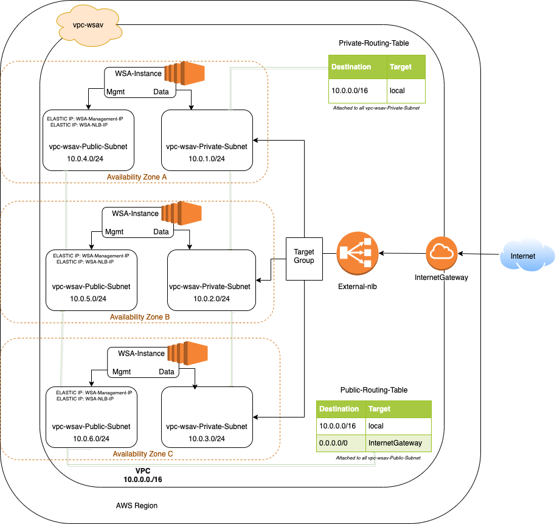

# Launching WSAv infrastructure on AWS with custom VPC, Security Groups and Load Balancer using Terraform

Create EC2 instances of wsav to be launced on AWS with custom network configurations (vpc, subnet, internet gateway, route table, network interfaces, elastic ips), security groups and network load balancer.


## Topology




## Installation

* Download Terraform - https://www.terraform.io/downloads.html. Update the system path variable to the location where the terraform executable is saved
* Configure AWS using IAM Access Key ID and Secret Access Key. Install aws cli - https://docs.aws.amazon.com/cli/latest/userguide/install-cliv2-mac.html

   ```bash
    aws configure

    AWS Access Key ID [None]: *******

    AWS Secret Access Key [None]: **********

    Default region name [None]: us-east-2

    Default output format [None]:
   ```


## Running Tests

To run tests, see examples

    
