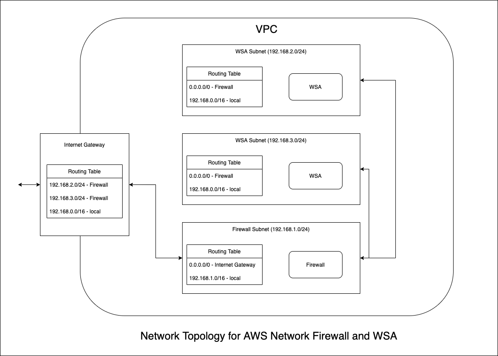

# AWS Firewall modulle

This terraform module adds AWS network firewall and associated routing logics.

## Topology



## Usage

### Create Firewall example

```
module "firewall" {
    source = "../../modules/firewall"
    vpc_id = module.network.id[0]
    vpc_cidr = "10.0.0.0/16"
    igw_id = module.network.aws_internet_gateway_id
    igw_route_table_id = module.network.aws_igw_route_table_id
    ec2_route_table_id = module.network.aws_ec2_route_table_id
    firewall_subnet_cidr = "10.0.4.0/24"
    ec2_subnet_cidrs = ["10.0.0.0/24", "10.0.2.0/24"]
    firewall_name = "my-network-firewall"
    firewall_policy_arn = aws_networkfirewall_firewall_policy.firewall_policy.arn
}
```
### Create Firewall policies

```
resource "aws_networkfirewall_firewall_policy" "firewall_policy" {
  name = "firewall-policy-nishant"

  firewall_policy {
    stateless_default_actions          = ["aws:pass"]
    stateless_fragment_default_actions = ["aws:pass"]
    stateless_rule_group_reference {
      priority = 1
      resource_arn = aws_networkfirewall_rule_group.icmp_group.arn
    }

    stateful_rule_group_reference {
      resource_arn = aws_networkfirewall_rule_group.tcp_block.arn
    }
  }

  tags = {
    Name = "Firewall policy"
  }
}


resource "aws_networkfirewall_rule_group" "tcp_block" {
  capacity    = 50
  description = "Permits ICMP traffic from source"
  name        = "tcp-block-rule"
  type        = "STATEFUL"
  rule_group {
    rules_source {
        stateful_rule {
            action = "PASS"
            # action = "DROP" # Don't keep it as DROP at first time boot up
            header {
                destination      = "ANY"
                destination_port = "8443"
                protocol         = "TCP"
                direction        = "ANY"
                source_port      = "ANY"
                source           = "ANY"
            }
            rule_option {
                keyword = "sid:1"
            }
        }
    }
  }

  tags = {
    Name = "permit ICMP from source"
  }
}


resource "aws_networkfirewall_rule_group" "icmp_group" {
  capacity = 100
  name     = "icmp-pass-rule"
  type     = "STATELESS"
  rule_group {
    rules_source {
      stateless_rules_and_custom_actions {
        stateless_rule {
          priority = 5
          rule_definition {
            actions = ["aws:pass"]
            # actions = ["aws:drop"]
            match_attributes {
              source {
                address_definition = "0.0.0.0/0"
              }
              destination {
                address_definition = "0.0.0.0/0"
              }
              protocols = [1] # 1 for ICMP
            }
          }
        }
      }
    }
  }
}
```

### Input variables

| Name | Description | Type | Default | Required |
| ---- | ----------- | ---- | ------- | -------- |
| vpc_id | Id of VPC | String | null | Yes |
| vpc_cidr | CIDR of VPC | String | null | Yes |
| availability_zone_count | Number of availability zones | Integer | 1 | No |
| ec2_route_table_id | Route tables of subnets having WSA instances | String | null | Yes |
| ec2_subnet_cidrs | CIDRs of subnets having WSA instances | List of String | null | Yes |
| firewall_subnet_cidr | CIDR of the subnet, which will be created for firewall | String | null | Yes |
| firewall_subnet_name | Name of the subnet, which will be created for firewall | String | FirewallSubnet | No |
| igw_id | Id of internet gateway | String | null | Yes |
| igw_route_table_id | Id of internet gateway route table | String | null | Yes |
| firewall_subnet_route_table_name | Name of the subnet route table, which will be created for firewall | String | firewallRT | No |
| firewall_name | Name of the firewall, which will be created | String | NetworkFirewall | No |
| firewall_policy_arn | ARN of firewall policy | String | null | Yes |

### Output

| Name | Description |
| ---- | ----------- |
| firewall_endpoint | Id of firewall endpoint |

